<div align="center">

# 💸 E-Wallet Frenzy (Frontend)
**Tugas Ujian Akhir Semester (UAS) Mobile Application**

   

Aplikasi Frontend E-Wallet komprehensif untuk pembayaran, transfer saldo, top-up, dan integrasi merchant.

**Moh Frendy Aprianto • 1123150125**

---

### 🎥 [Tonton Video Presentasi / Demo di YouTube](https://youtu.be/tzie9l5RnwQ?si=2drLyATr8UgkY9q4) 🎥

</div>

---

## 📋 Daftar Isi

- [Tentang Aplikasi](#-tentang-aplikasi)
- [Ekosistem Aplikasi](#-ekosistem-aplikasi)
- [Fitur Utama](#-fitur-utama)
- [Teknologi & Arsitektur](#️-teknologi--arsitektur-utama)
- [Struktur Folder](#-struktur-folder)
- [Screenshot Aplikasi](#-screenshot-aplikasi)
- [Cara Menjalankan](#-cara-menjalankan-project)
- [Developer](#-developer)
- [Lisensi](#-lisensi)

---

## 💡 Tentang Aplikasi

**E-Wallet Frenzy** adalah aplikasi dompet digital berbasis Flutter yang dirancang untuk memudahkan aktivitas keuangan sehari-hari. Aplikasi ini mendukung transfer saldo, top-up, pembayaran tagihan, scan QR, serta terintegrasi langsung dengan merchant **Bag Store** sebagai ekosistem e-commerce yang lengkap.

Dibangun menggunakan prinsip **Clean Architecture** untuk memastikan kode yang bersih, terstruktur, dan mudah dikembangkan lebih lanjut.

> 🏆 Proyek ini merupakan bagian dari ekosistem dua aplikasi yang saling terhubung — **Wallet Frenzy** sebagai dompet digital dan **Bag Store** sebagai platform belanja tas premium.

---

## 🌐 Ekosistem Aplikasi

Proyek ini terdiri dari **4 repository** yang saling terhubung membentuk ekosistem penuh:

| Komponen | Deskripsi | Repository |
|:---:|:---|:---:|
| 📱 **Frontend E-Wallet** | Aplikasi Flutter E-Wallet *(Anda di sini)* | — |
| ⚙️ **Backend E-Wallet** | REST API untuk layanan E-Wallet | [Klik disini](https://github.com/tuckerr10/e-wallet-back-end.git) |
| 🛍️ **Frontend Bag Store** | Aplikasi Flutter E-Commerce Tas | [Klik disini](https://github.com/tuckerr10/bag-store-UAS.git) |
| 🗄️ **Backend Bag Store** | REST API untuk layanan Bag Store | [Klik disini](https://github.com/tuckerr10/bag-store-be-UAS.git) |

---

## ✨ Fitur Utama

### 💳 Wallet Frenzy

| Fitur | Keterangan |
|:---|:---|
| 🔐 **Autentikasi** | Login dengan Email/Password atau Google (Firebase Auth) |
| 💰 **Saldo & Kartu Virtual** | Tampilan saldo real-time dengan kartu Visa virtual |
| 📤 **Transfer Saldo** | Kirim saldo ke sesama pengguna |
| 🔋 **Top-Up** | Isi ulang saldo dengan mudah |
| 📱 **Pembayaran Tagihan** | Pulsa, PLN, Data, dan Bayar via QR |
| 📊 **Riwayat Transaksi** | Histori semua pemasukan dan pengeluaran dengan filter |
| 🔔 **Notifikasi Push** | Real-time notification via Firebase Cloud Messaging |
| 🔒 **Keamanan Berlapis** | PIN terenkripsi, 2FA via Email OTP, Login Biometrik (Sidik Jari) |
| 🏪 **Integrasi Merchant** | Terhubung langsung dengan Bag Store untuk pembayaran seamless |

### 🛍️ Bag Store (Merchant Terintegrasi)

| Fitur | Keterangan |
|:---|:---|
| 🏠 **Beranda Produk** | Daftar produk dengan filter All, Trending, Top, Recent |
| 🛒 **Keranjang & Checkout** | Kelola produk, kode promo, dan metode pembayaran |
| 💳 **Bayar via Wallet Frenzy** | Pembayaran langsung menggunakan saldo E-Wallet |
| 💵 **COD (Cash on Delivery)** | Opsi bayar tunai di tempat |
| 👤 **Profil Pengguna** | Edit profil, riwayat pembelian, pengaturan keamanan |

---

## 🛠️ Teknologi & Arsitektur Utama

### 🏛️ Arsitektur

Aplikasi dibangun dengan berpegang pada prinsip **Clean Architecture** (Domain, Data, Presentation) untuk memastikan skalabilitas dan kode yang bersih.

```
┌─────────────────────────────────────────┐
│           Presentation Layer            │
│       (BLoC, Pages, Widgets)            │
├─────────────────────────────────────────┤
│              Domain Layer               │
│   (Use Cases, Entities, Repo Interface) │
├─────────────────────────────────────────┤
│               Data Layer                │
│ (Models, API Datasources, Repositories) │
└─────────────────────────────────────────┘
```

### 📦 Package & Library

| Kategori | Library |
|:---|:---|
| 🏗️ **State Management & DI** | `flutter_bloc`, `get_it` |
| 🔗 **Networking** | `dio`, `pretty_dio_logger` |
| 🔐 **Keamanan & Storage** | `flutter_secure_storage`, `shared_preferences` |
| 🧭 **Navigasi & Deep Link** | `go_router`, `app_links`, `url_launcher` |
| 🔥 **Firebase** | `firebase_auth`, `google_sign_in`, `firebase_messaging` |
| 📷 **QR Scanner** | `mobile_scanner` |
| 🔔 **Notifikasi Lokal** | `flutter_local_notifications` |
| ✨ **UI/UX** | `shimmer` (skeleton loading) |

---

## 📂 Struktur Folder

<details>
<summary><b>📁 Klik untuk melihat struktur direktori <code>lib/</code></b></summary>

```text
lib/
├── core/                   # Logika pendukung (Router, Utils, Constants, Network Info)
├── data/                   # Layer Data (API, Datasources, Models, Repositories Impl)
├── domain/                 # Layer Domain (Entities, Usecases, Repo Interfaces)
├── injection/              # Konfigurasi Dependency Injection (get_it)
├── presentation/           # Layer UI (Blocs, Pages, Widgets)
└── main.dart               # Entry point aplikasi
```

</details>

---

## 📱 Screenshot Aplikasi

### 💜 Wallet Frenzy

<table>
  <tr>
    <td align="center"><b>Splash Screen</b></td>
    <td align="center"><b>Splash + Tombol</b></td>
    <td align="center"><b>Home (Saldo)</b></td>
    <td align="center"><b>Home (Transaksi)</b></td>
  </tr>
  <tr>
    <td>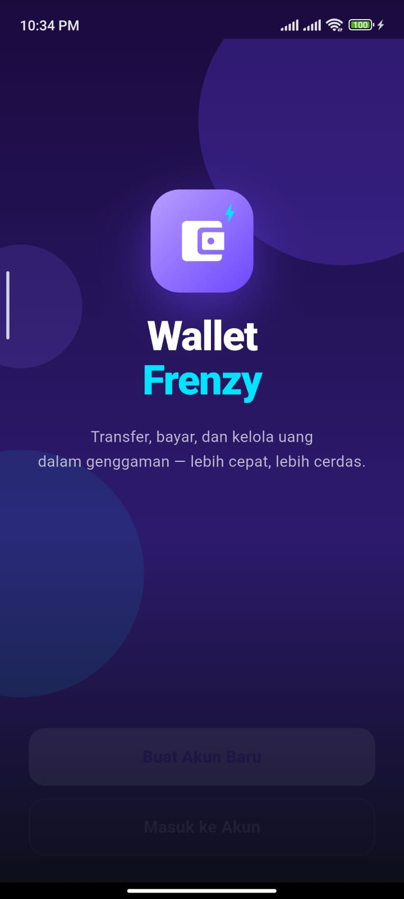</td>
    <td>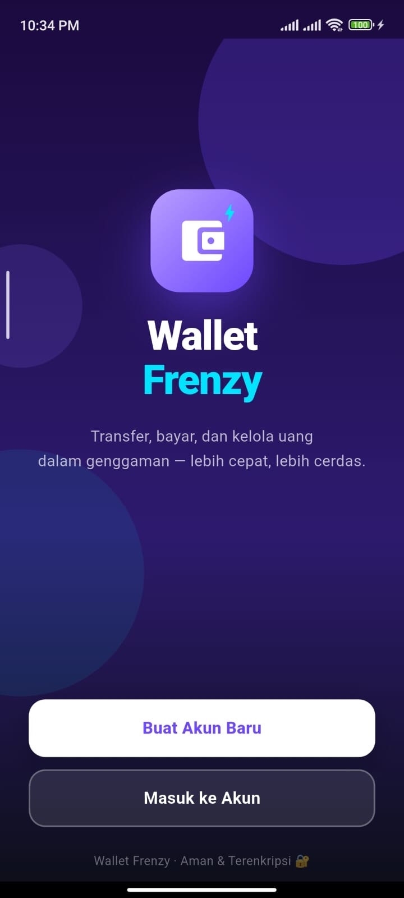</td>
    <td>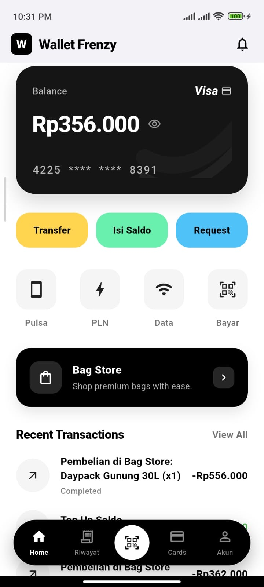</td>
    <td>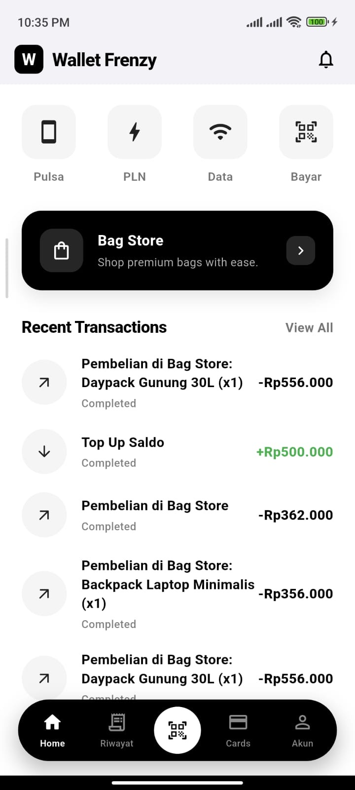</td>
  </tr>
  <tr>
    <td align="center"><b>Login</b></td>
    <td align="center"><b>My Cards</b></td>
    <td align="center"><b>Riwayat</b></td>
    <td align="center"><b>Akun</b></td>
  </tr>
  <tr>
    <td>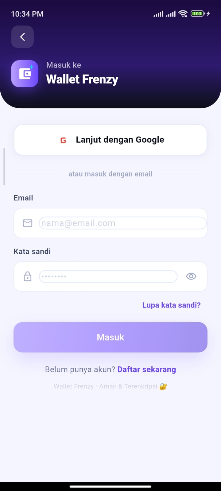</td>
    <td>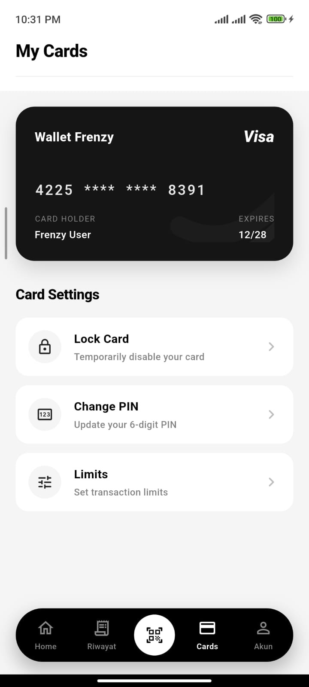</td>
    <td>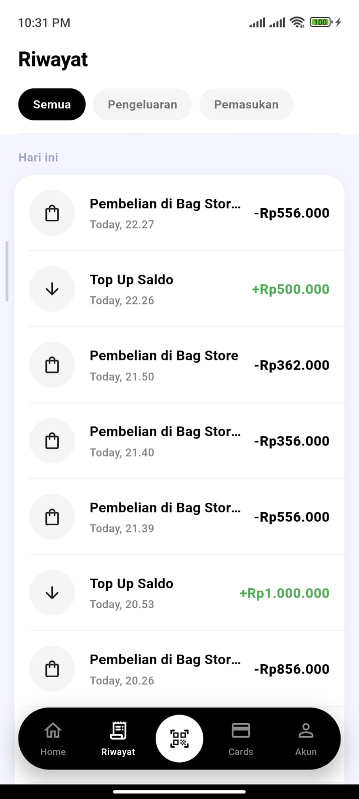</td>
    <td>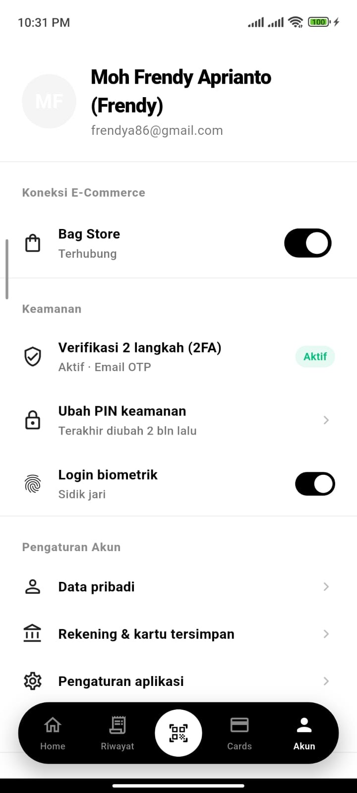</td>
  </tr>
  <tr>
    <td align="center"><b>Pembayaran</b></td>
    <td></td>
    <td></td>
    <td></td>
  </tr>
  <tr>
    <td>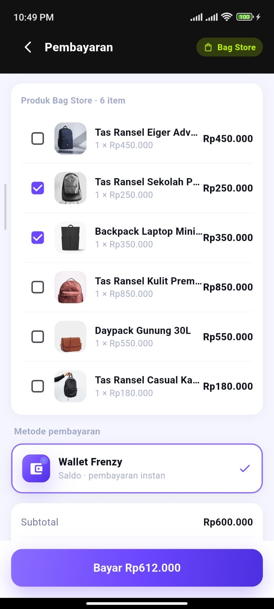</td>
    <td></td>
    <td></td>
    <td></td>
  </tr>
</table>

---

### 🟢 Bag Store

<table>
  <tr>
    <td align="center"><b>Splash</b></td>
    <td align="center"><b>Login</b></td>
    <td align="center"><b>Home</b></td>
    <td align="center"><b>Cart</b></td>
  </tr>
  <tr>
    <td>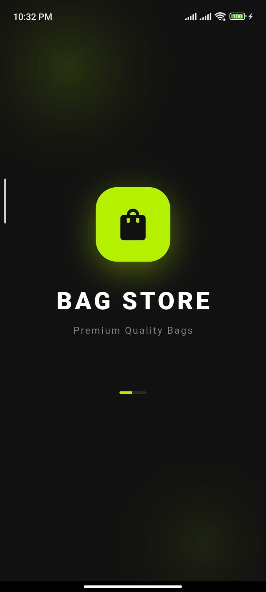</td>
    <td>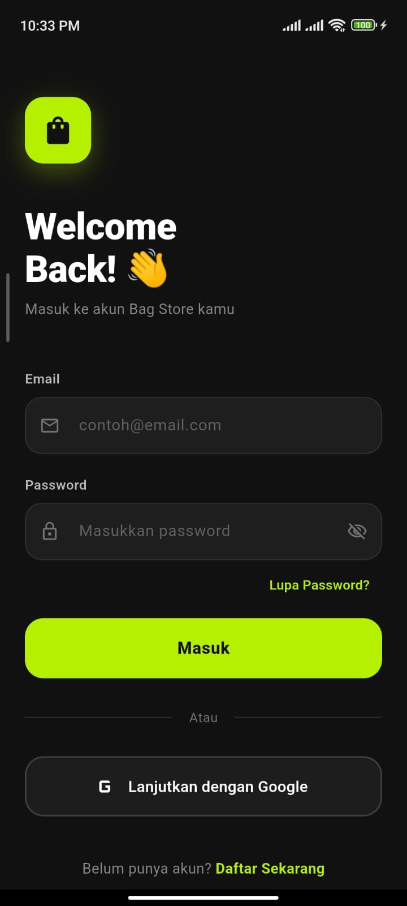</td>
    <td>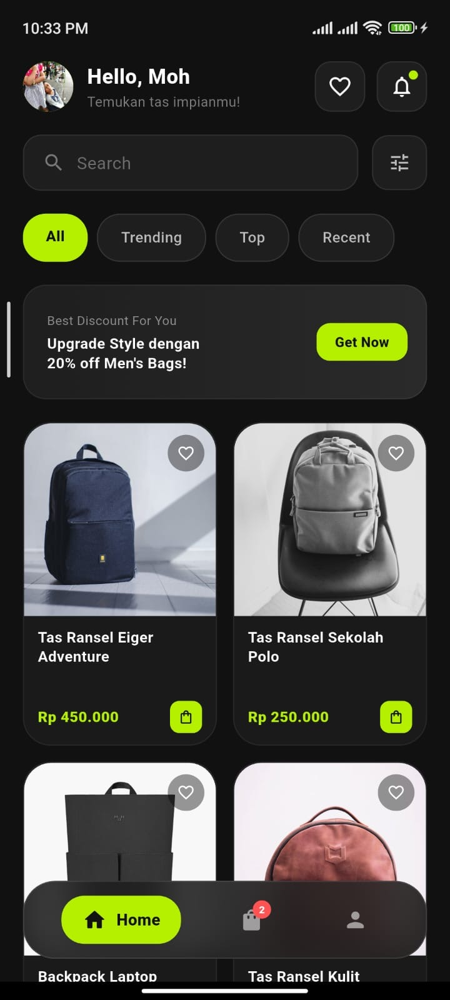</td>
    <td>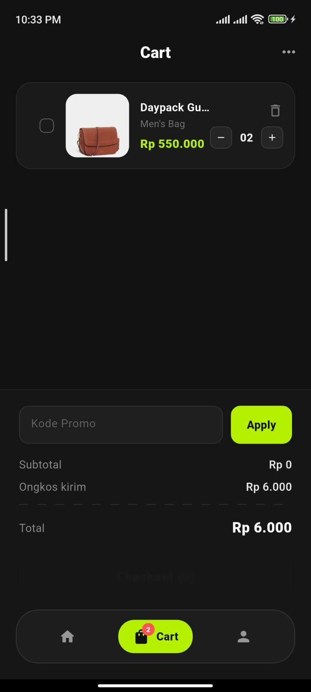</td>
  </tr>
  <tr>
    <td align="center"><b>Cart (Error)</b></td>
    <td align="center"><b>Checkout</b></td>
    <td align="center"><b>Profil</b></td>
    <td align="center"><b>Profil & Settings</b></td>
  </tr>
  <tr>
    <td>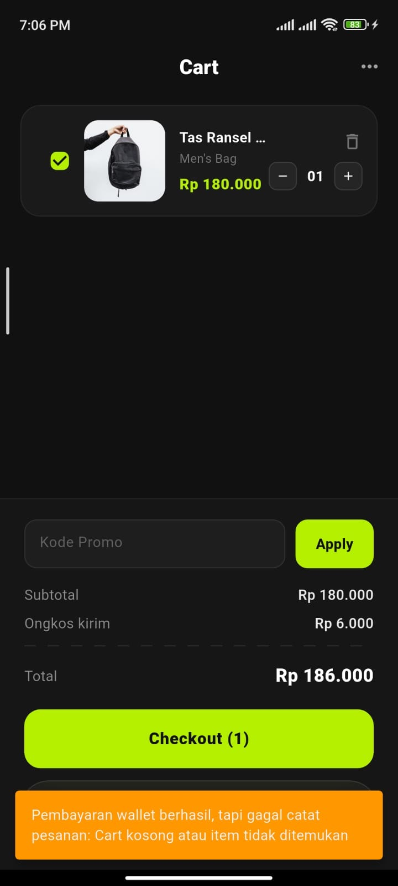</td>
    <td>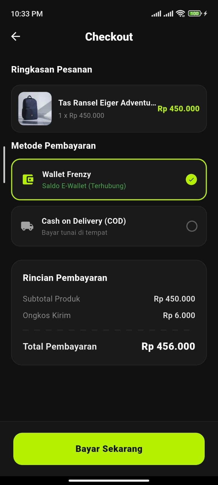</td>
    <td>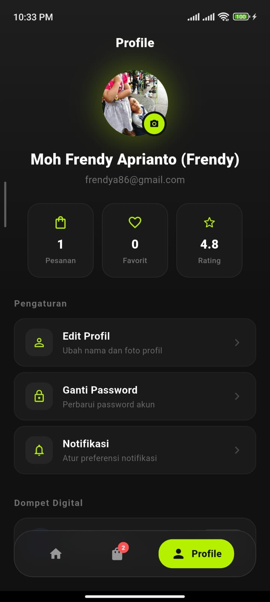</td>
    <td>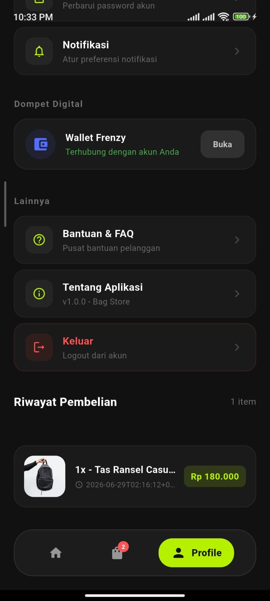</td>
  </tr>
</table>

---

## 🚀 Cara Menjalankan Project

### Prasyarat

- ✅ Flutter SDK **≥ 3.0.0**
- ✅ Dart **≥ 3.0.0**
- ✅ Android Studio / VS Code
- ✅ Emulator Android atau perangkat fisik
- ✅ Backend E-Wallet & Bag Store sudah berjalan

### Langkah-Langkah

**1. Cek instalasi Flutter**
```bash
flutter doctor
```

**2. Clone repositori ini**
```bash
git clone https://github.com/tuckerr10/e-wallet.git
cd e-wallet
```

**3. Install semua dependensi**
```bash
flutter pub get
```

**4. Jalankan aplikasi**
```bash
flutter run
```

> ⚠️ **Penting:** Pastikan server Backend E-Wallet sudah berjalan terlebih dahulu agar koneksi API dapat berfungsi dengan baik.

---

## 👨‍💻 Developer

<div align="center">

| | |
|:---:|:---|
| 👤 **Nama** | Moh Frendy Aprianto (Frendy) |
| 📧 **Email** | frendya86@gmail.com |
| 🆔 **NIM** | 1123150125 |
| 📚 **Mata Kuliah** | Mobile Application |
| 📅 **Semester** | UAS 2025/2026 |

</div>

---

## 📄 Lisensi

Proyek ini dibuat untuk keperluan akademik (Ujian Akhir Semester). Tidak untuk dipublikasikan atau digunakan secara komersial tanpa izin.

---

<div align="center">

Made with ❤️ using **Flutter**

⭐ Jangan lupa beri bintang kalau project ini membantu!

</div>
